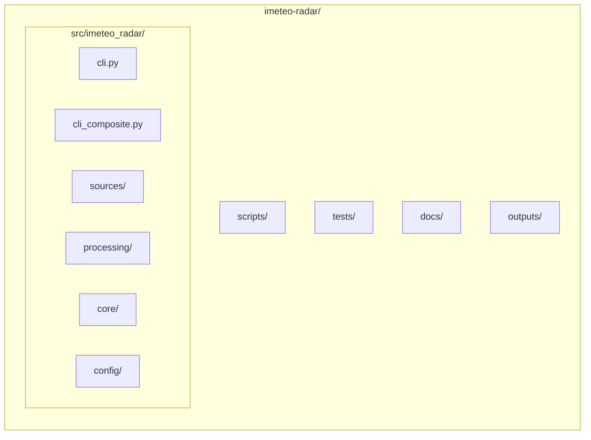

# Claude Code Configuration

## Project Overview

iMeteo Radar is a multi-source weather radar data processing system that handles DWD (Germany), SHMU (Slovakia), and CHMI (Czech Republic) radar data. The system downloads ODIM_H5 format radar data, processes it with proper colorscaling and transparency, and exports PNG images suitable for web mapping applications. Supports composite radar images that merge data from multiple sources.

## Project Structure



## Key Commands

```bash
# Fetch from single source
imeteo-radar fetch --source dwd|shmu|chmi

# Generate composite
imeteo-radar composite

# Generate extent metadata
imeteo-radar extent --source all

# Backload historical data
imeteo-radar fetch --source dwd --backload --hours 6
```

## Quick Start

```bash
python -m venv .venv
source .venv/bin/activate
pip install -e ".[dev]"
imeteo-radar --help
```

## Documentation

| Topic | File |
|-------|------|
| CLI commands & options | [docs/cli-reference.md](docs/cli-reference.md) |
| Docker, K8s, cloud | [docs/deployment.md](docs/deployment.md) |
| Architecture & pipeline | [docs/architecture.md](docs/architecture.md) |
| Development setup | [docs/development.md](docs/development.md) |
| Monitoring & debugging | [docs/monitoring.md](docs/monitoring.md) |

## Code Quality

```bash
black src/
isort src/
mypy src/
pytest
```
