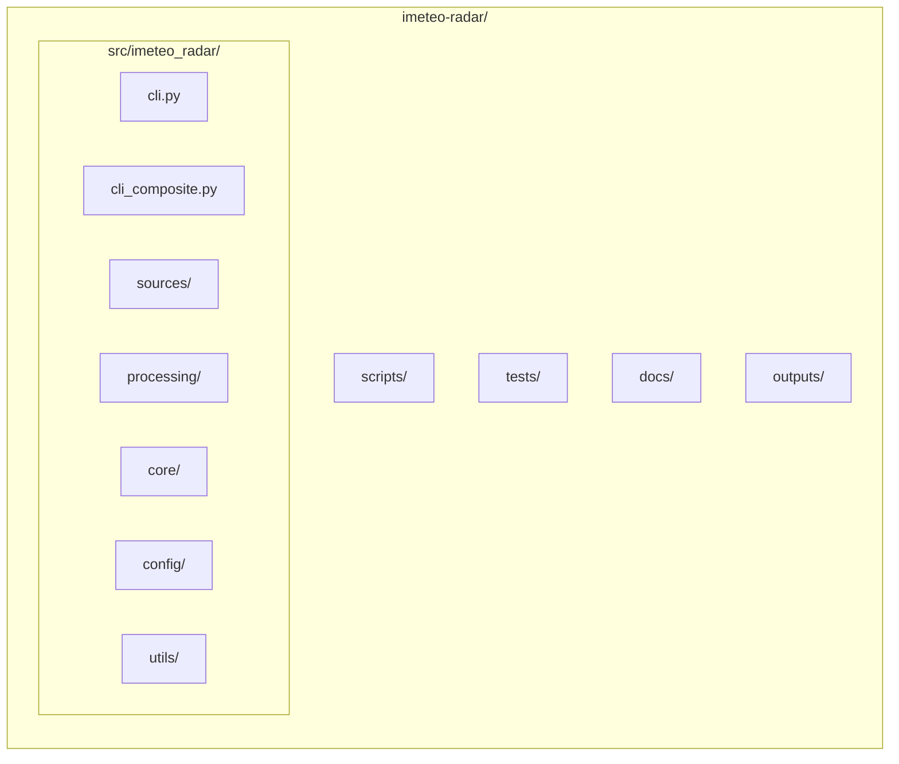

# Claude Code Configuration

## Project Overview

iMeteo Radar is a multi-source weather radar data processing system that handles DWD (Germany), SHMU (Slovakia), CHMI (Czech Republic), OMSZ (Hungary), ARSO (Slovenia), and IMGW (Poland) radar data. The system downloads ODIM_H5/netCDF/SRD-3 format radar data, reprojects it to Web Mercator using rasterio, and exports PNG images suitable for web mapping applications. Supports composite radar images that merge data from multiple sources, with three-tier transform caching for fast reprojection.

## Project Structure



## Key Commands

```bash
# Fetch from single source (saves to outputs/{source}/)
imeteo-radar fetch --source dwd --output ./outputs/germany
imeteo-radar fetch --source shmu --output ./outputs/slovakia
imeteo-radar fetch --source chmi --output ./outputs/czechia
imeteo-radar fetch --source imgw --output ./outputs/poland
imeteo-radar fetch --source omsz --output ./outputs/hungary
imeteo-radar fetch --source arso --output ./outputs/slovenia

# Generate composite
imeteo-radar composite --output ./outputs/composite

# Generate extent metadata
imeteo-radar extent --source all

# Generate coverage masks
imeteo-radar coverage-mask --output ./outputs

# Manage transform cache
imeteo-radar transform-cache --precompute
imeteo-radar transform-cache --stats

# Backload historical data
imeteo-radar fetch --source dwd --backload --hours 6 --output ./outputs/germany
```

## Output Directory Structure

```
outputs/
├── index.html          # Leaflet viewer (DO NOT DELETE)
├── germany/            # DWD radar data
├── slovakia/           # SHMU radar data
├── czechia/            # CHMI radar data
├── poland/             # IMGW radar data
├── hungary/            # OMSZ radar data
├── slovenia/           # ARSO radar data
└── composite/          # Merged composite images
```

## Quick Start

```bash
python -m venv .venv
source .venv/bin/activate
pip install -e ".[dev]"
imeteo-radar --help
```

## Documentation

| Topic | File |
|-------|------|
| CLI commands & options | [docs/cli-reference.md](docs/cli-reference.md) |
| Data flow & sequences | [docs/data-flow.md](docs/data-flow.md) |
| Docker, K8s, cloud | [docs/deployment.md](docs/deployment.md) |
| Architecture & pipeline | [docs/architecture.md](docs/architecture.md) |
| Development setup | [docs/development.md](docs/development.md) |
| Monitoring & debugging | [docs/monitoring.md](docs/monitoring.md) |

## Git Workflow (MANDATORY)

This project uses git-flow. All agents and contributors MUST follow these rules.

### Branch Naming

| Prefix | Purpose | Example |
|--------|---------|---------|
| `feature/` | New functionality | `feature/arso-source` |
| `fix/` | Bug fixes | `fix/dwd-timeout` |
| `chore/` | Maintenance, CI, deps | `chore/optimize-ci` |
| `release/` | Version bumps, changelog | `release/v2.9.0` |
| `hotfix/` | Urgent production fixes | `hotfix/composite-crash` |

### Rules

1. **Never commit directly to `main`** — always use a feature branch + PR
2. **Branch names must use a prefix** from the table above — enforced by local git hooks
3. **One PR per concern** — don't mix features with fixes or chores
4. **Squash merge** PRs into main to keep history clean
5. **Tag releases** on main after merge: `git tag v2.X.Y && git push origin v2.X.Y`
6. **Delete branches** after merge — keep only `main` and active work branches

### Release Process

```bash
# 1. Create branch
git checkout -b release/v2.9.0

# 2. Bump version in pyproject.toml, update CHANGELOG.md, commit

# 3. Push and create PR
git push -u origin release/v2.9.0
gh pr create --title "release: v2.9.0"

# 4. After merge, tag and push
git checkout main && git pull
git tag v2.9.0 && git push origin v2.9.0

# 5. CI builds and pushes Docker image automatically (tag push only)
```

### CI/CD

- **PR**: validate job (build only, no push, amd64)
- **Tag push** (`v*`): build-and-push job (amd64, pushes to DockerHub)
- **Main push**: no build — tag push is the only trigger for releases

## Code Quality

```bash
black src/
isort src/
mypy src/
pytest
```
