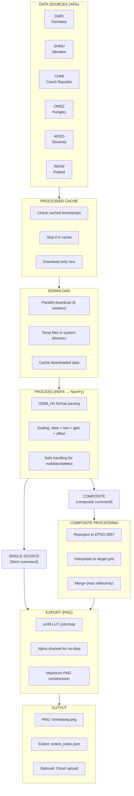
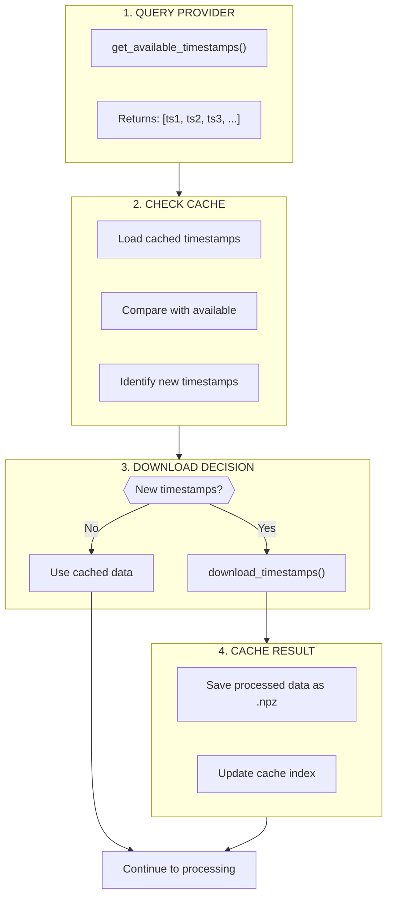
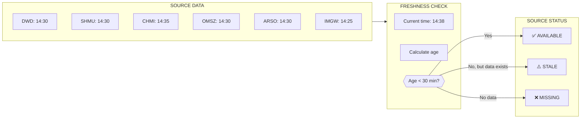
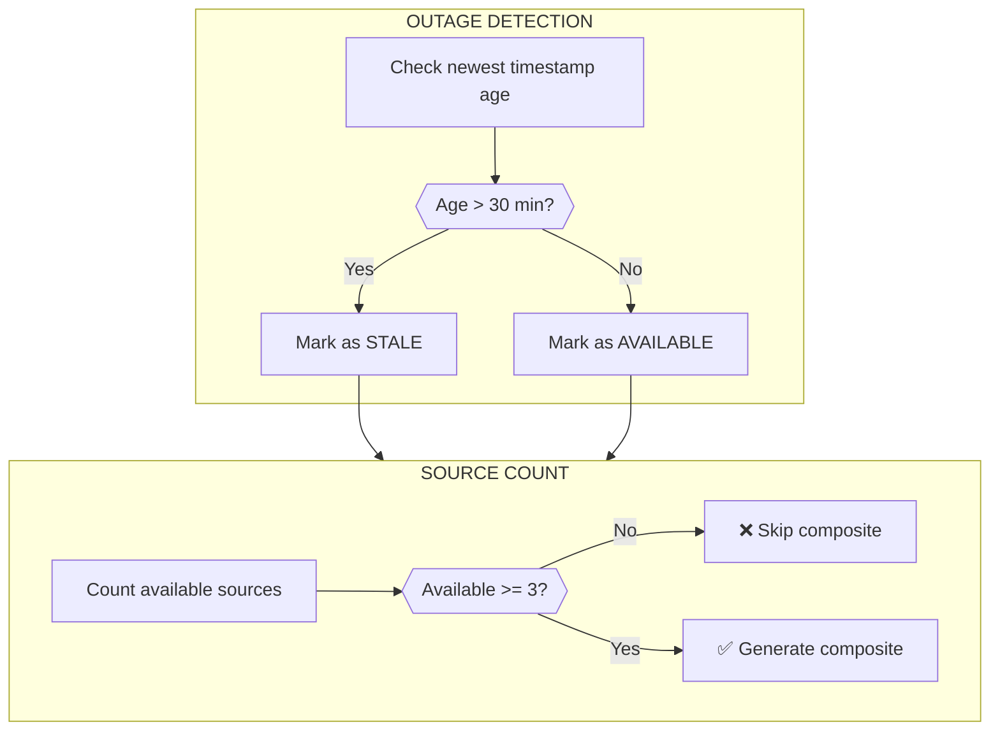
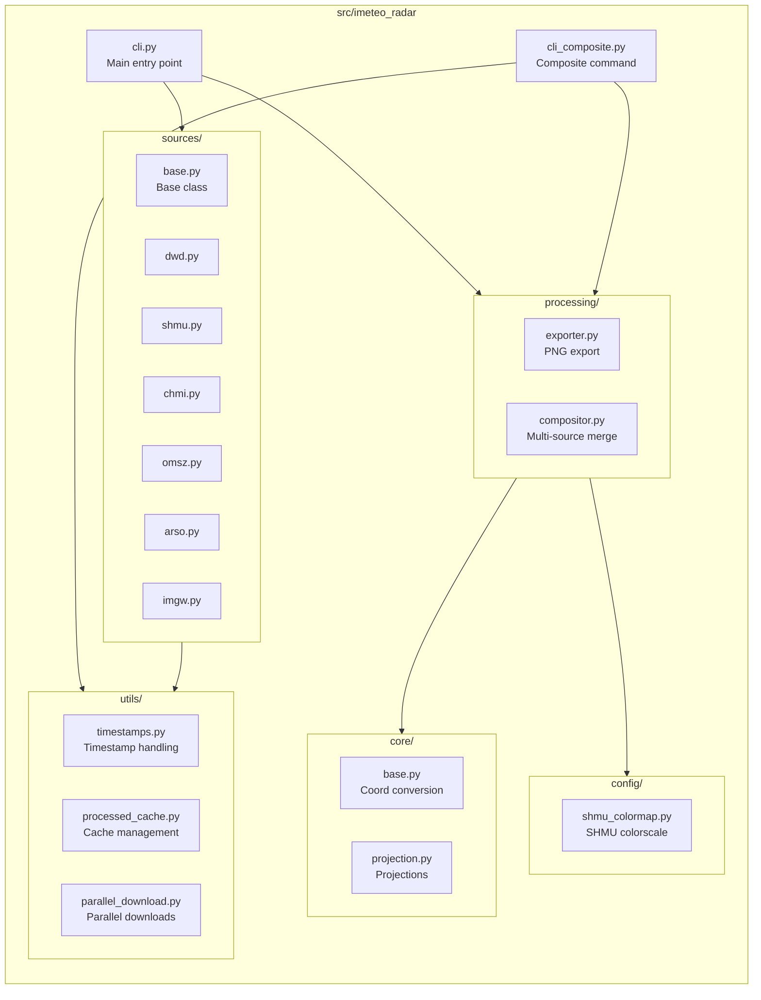

# Architecture

Technical overview of the iMeteo Radar data processing system.

---

## Data Pipeline



---

## Source Implementations

### DWD (German Weather Service)

| Property | Value |
|----------|-------|
| **Base URL** | https://opendata.dwd.de/weather/radar/composite |
| **Product** | dmax (maximum reflectivity) |
| **Format** | ODIM_H5 |
| **Projection** | Stereographic (DWD-specific) |
| **Grid size** | ~4800 × 4400 pixels |
| **Resolution** | ~1 km |
| **Coverage** | 1.5°-18.7°E, 45.7°-56.2°N |

**Implementation**: `src/imeteo_radar/sources/dwd.py`

### SHMU (Slovak Hydrometeorological Institute)

| Property | Value |
|----------|-------|
| **Base URL** | https://opendata.shmu.sk/meteorology/weather/radar/composite/skcomp |
| **Product** | zmax (maximum reflectivity) |
| **Format** | ODIM_H5 |
| **Projection** | Web Mercator (EPSG:3857) |
| **Grid size** | 1560 × 2270 pixels |
| **Resolution** | ~400 m |
| **Coverage** | 13.6°-23.8°E, 46.0°-50.7°N |

**Implementation**: `src/imeteo_radar/sources/shmu.py`

### CHMI (Czech Hydrometeorological Institute)

| Property | Value |
|----------|-------|
| **Base URL** | https://opendata.chmi.cz/meteorology/weather/radar/composite/maxz/hdf5 |
| **Product** | maxz (maximum reflectivity) |
| **Format** | ODIM_H5 |
| **Projection** | Web Mercator (EPSG:3857) |
| **Grid size** | Variable |
| **Resolution** | ~500 m |
| **Coverage** | 12°-19°E, 48.5°-51.1°N |

**Implementation**: `src/imeteo_radar/sources/chmi.py`

### OMSZ (Hungarian Meteorological Service)

| Property | Value |
|----------|-------|
| **Base URL** | https://odp.met.hu/weather/radar/composite/nc |
| **Product** | cmax (refl2D - column maximum reflectivity) |
| **Format** | netCDF (zipped) |
| **Projection** | Geographic (lat/lon grid) |
| **Grid size** | 813 × 961 pixels |
| **Resolution** | ~890 m × 930 m |
| **Coverage** | 13.5°-25.5°E, 44.0°-50.5°N |

**Implementation**: `src/imeteo_radar/sources/omsz.py`

### ARSO (Slovenian Environment Agency)

| Property | Value |
|----------|-------|
| **Base URL** | https://meteo.arso.gov.si/uploads/probase/www/observ/radar |
| **Product** | zm (si0-zm.srd - maximum reflectivity) |
| **Format** | SRD-3 (proprietary ASCII + byte-encoded) |
| **Projection** | Lambert Conformal Conic (SIRAD) |
| **Grid size** | 401 × 301 pixels |
| **Resolution** | 1 km |
| **Coverage** | ~12.8°-16.8°E, ~45.3°-47.1°N |

**Note**: ARSO only provides the latest timestamp (no archive).

**Implementation**: `src/imeteo_radar/sources/arso.py`

### IMGW (Polish Institute of Meteorology and Water Management)

| Property | Value |
|----------|-------|
| **Base URL** | https://danepubliczne.imgw.pl/pl/datastore/getfiledown/Oper/Polrad/Produkty/HVD |
| **Product** | cmax (COMPO_CMAX_250 - column maximum reflectivity) |
| **Format** | ODIM_H5 |
| **Projection** | Geographic (lat/lon from HDF5 corners) |
| **Grid size** | Variable (from HDF5 metadata) |
| **Resolution** | Variable (from HDF5 metadata) |
| **Coverage** | 13.0°-26.4°E, 48.1°-56.2°N |

**Implementation**: `src/imeteo_radar/sources/imgw.py`

---

## Cache-Aware Downloading

The composite command uses intelligent caching to minimize redundant downloads and network usage.

### How It Works



### Cache Structure

Processed radar data is cached as NumPy compressed files (`.npz`):

```
~/.cache/imeteo-radar/
├── dwd_dmax_202601281430.npz
├── shmu_zmax_202601281430.npz
├── chmi_maxz_202601281435.npz
├── omsz_cmax_202601281430.npz
├── arso_zm_202601281430.npz
└── imgw_cmax_202601281425.npz
```

Each `.npz` file contains:
- `data`: Processed reflectivity array (float32)
- `extent`: Geographic bounds [west, east, south, north]
- `projection`: Source projection string
- `timestamp`: Original timestamp

### Timestamp Normalization

Different sources use different timestamp formats:

| Source | Format | Example |
|--------|--------|---------|
| DWD | `YYYYMMDD_HHMM` | `20260128_1430` |
| SHMU | `YYYYMMDDHHMM` | `202601281430` |
| CHMI | `YYYYMMDDHHMMSS` | `20260128143500` |
| Cache | `YYYYMMDDHHMM00` | `202601281430` (normalized) |

The `is_timestamp_in_cache()` utility handles normalization:

```python
def is_timestamp_in_cache(timestamp: str, cached_set: set[str]) -> bool:
    """Check if timestamp matches any cache entry."""
    ts_clean = timestamp.replace("_", "")
    ts_12 = ts_clean[:12]
    ts_14 = ts_12 + "00"
    return any(t in cached_set for t in [timestamp, ts_clean, ts_12, ts_14])
```

### Efficiency Gains

| Metric | Without Cache | With Cache |
|--------|---------------|------------|
| Downloads per run | ~48 files | ~6 files |
| Network usage | ~50 MB | ~6 MB |
| Run time | ~30 sec | ~10 sec |

---

## Data Freshness

The system tracks data freshness to detect outages and stale sources.

### Freshness Flow



### Composite Skip Reasons

When a timestamp is not processed, one of three reasons applies:

| Reason | Description | Log |
|--------|-------------|-----|
| `already_exists` | Composite PNG already generated | `Already exist (local/S3): 5` |
| `insufficient_sources` | Less than 3 core sources available | `Insufficient sources: 1` |
| `processing_failed` | Error during merge/export | `Processing failed: 0` |

### Outage Detection

The system detects source outages using:

1. **Staleness threshold**: Data older than 30 minutes
2. **Minimum sources**: At least 3/5 core sources required
3. **Consecutive failures**: Tracked for alerting



---

## Composite Generation

### Merging Strategy

The compositor uses **maximum reflectivity** merging:

```python
# For each grid cell, take the highest dBZ value
merged = np.fmax(source1, source2, source3)
```

This ensures:
- Precipitation is never underestimated
- Overlapping regions show strongest returns
- No-data areas from one source are filled by others

### Reprojection

All sources are reprojected to Web Mercator (EPSG:3857):

1. Extract source coordinates (1D arrays or 2D meshgrids)
2. Transform to Web Mercator using `pyproj`
3. Create `RegularGridInterpolator` for each source
4. Resample to target grid (nearest-neighbor)

**Implementation**: `src/imeteo_radar/processing/compositor.py`

### Target Grid

| Property | Default Value |
|----------|---------------|
| **Projection** | Web Mercator (EPSG:3857) |
| **Resolution** | 500 m |
| **Extent** | 2.5°-23.8°E, 45.5°-56°N |
| **Grid size** | ~3500 × 3500 pixels |

---

## Memory Optimizations

### Overview

The system was optimized from **4.8 GB** to **669 MB** (86% reduction).

### Key Optimizations

#### 1. uint8 LUT Colormap

**Problem**: Matplotlib creates 645 MB float64 RGBA arrays.

**Solution**: Pre-compute 256-entry uint8 lookup table.

```python
# Before: 886 MB peak
colors = colormap(normalize(data))  # float64 intermediate
rgba = (colors * 255).astype(np.uint8)

# After: 100 MB peak
indices = ((data - vmin) / (vmax - vmin) * 255).astype(np.uint8)
rgba = lut[indices]  # Direct lookup
```

**Savings**: ~786 MB per image

#### 2. Lazy Coordinate Generation

**Problem**: Creating 4800×4400 coordinate meshgrids (322 MB) that are never used after extent calculation.

**Solution**: Calculate extent from 4 corner coordinates only.

```python
# Before: 322 MB
lons_2d, lats_2d = np.meshgrid(lons, lats)
extent = {'west': lons_2d.min(), ...}

# After: ~200 bytes
corners = get_corners_from_hdf5()
extent = {'west': min(corners.lons), ...}
```

**Savings**: ~322 MB per image

#### 3. Memory Leak Fix

**Problem**: Matplotlib figure objects accumulating across files.

**Solution**: Explicit cleanup after each export.

```python
import matplotlib.pyplot as plt
import gc

# After export
plt.close('all')
gc.collect()
```

### Memory Usage

| Operation | Memory |
|-----------|--------|
| Single fetch | ~670 MB peak |
| 12-file backload | ~670 MB peak (constant) |
| Composite (3 sources) | ~1.2 GB peak |

---

## Colormap

### SHMU Official Scale

All sources use the official SHMU colorscale:

- **Range**: -35 to 85 dBZ
- **Resolution**: 1 dBZ steps
- **Colors**: 121 discrete colors

| dBZ Range | Color |
|-----------|-------|
| -35 to 0 | Black to dark blue |
| 0 to 20 | Blue to cyan |
| 20 to 40 | Green to yellow |
| 40 to 60 | Orange to red |
| 60 to 85 | Red to purple |

**Implementation**: `src/imeteo_radar/config/shmu_colormap.py`

---

## Projection Handling

### DWD Stereographic

DWD uses a custom stereographic projection defined in HDF5 `proj_def` attribute.

The `ProjectionHandler` class handles:
1. Parse projection definition from HDF5
2. Create transformer using `pyproj`
3. Convert corner coordinates to WGS84
4. Calculate extent bounds

**Implementation**: `src/imeteo_radar/core/projection.py`

### Web Mercator (SHMU/CHMI)

SHMU and CHMI data is already in Web Mercator (EPSG:3857).

Coordinate extraction:
1. Read corner coordinates from HDF5 `where` attributes
2. Create 1D linspace arrays for x and y
3. No reprojection needed for single-source export

---

## File Structure



---

## Performance Characteristics

### Download

- **Workers**: 6 concurrent
- **Processed data cache**: Skip downloads for cached timestamps
- **Timeout**: 30 seconds per file
- **Cache format**: NumPy compressed (`.npz`)

### Cache Efficiency

| Scenario | Downloads | Savings |
|----------|-----------|---------|
| Cold cache (first run) | 8 files × 6 sources | 0% |
| Warm cache (steady state) | 1 file × 6 sources | ~87% |
| Full cache hit (no updates) | 0 files | 100% |

### Processing

- **Time complexity**: O(n) where n = grid size
- **Memory**: Constant regardless of file count
- **Cleanup**: Automatic after each file

### Export

- **Method**: PIL with pre-computed LUT
- **Compression**: Maximum PNG level 9
- **Speed**: 4-10x faster than matplotlib

### Typical Run Times

| Operation | Cold Cache | Warm Cache |
|-----------|------------|------------|
| Composite (6 sources) | ~30 sec | ~10 sec |
| Single fetch | ~5 sec | ~2 sec |
| Cache lookup | - | <100 ms |

---

## Kubernetes Recommendations

Based on memory optimizations:

| Metric | Value |
|--------|-------|
| **Pod memory limit** | 1.2 GB |
| **Pods per 16 GB node** | 10-12 |
| **Estimated monthly savings** | ~50% vs unoptimized |

See [deployment.md](deployment.md) for detailed Kubernetes manifests.
