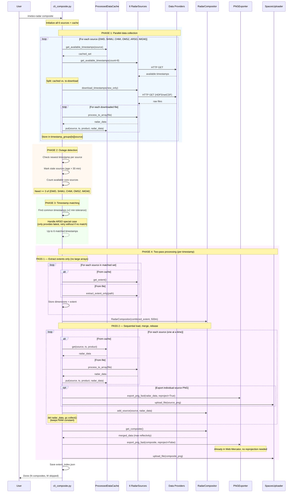
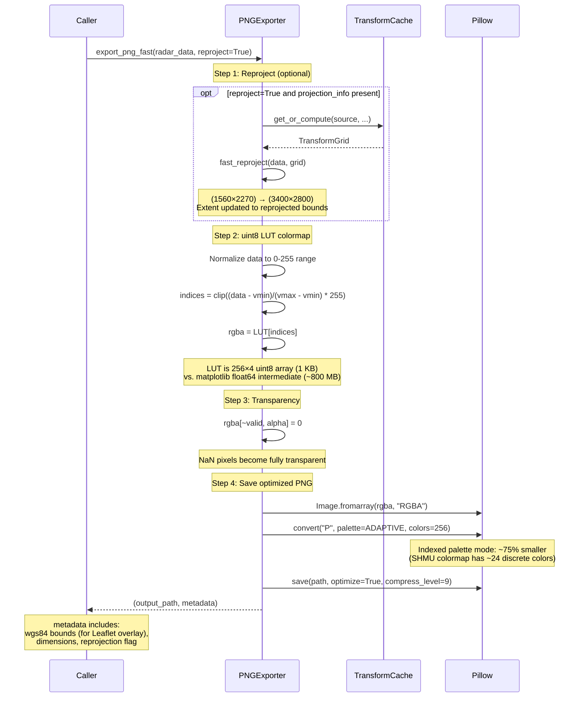

# Data Flow

Sequence diagrams and flow visualizations for the iMeteo Radar processing pipeline.

---

## 1. Single Source Fetch

The `fetch` command downloads radar data from one source, reprojects it to Web Mercator, and exports PNG images.

---

## 2. Composite Generation

The `composite` command fetches from all sources, matches timestamps across providers, and merges using maximum reflectivity.

---

## 3. Dual-Layer Processed Data Cache

Caches parsed radar arrays (float32) and metadata to avoid re-downloading from providers.

### Cache filesystem layout

---

## 4. Three-Tier Transform Cache

Precomputed pixel-to-pixel index mappings for 10-50x faster reprojection. Since radar source extents are static, these grids are computed once and reused indefinitely.

### TransformGrid structure

---

## 5. Reprojection Pipeline

How source data in native projections gets reprojected to Web Mercator (EPSG:3857) for web map display.

### Native projections per source

---

## 6. PNG Export Pipeline

From raw float32 reflectivity array to optimized PNG file.

---

## 7. Extent Index Lifecycle

How `extent_index.json` is generated, stored, and consumed by downstream components.

### extent_index.json structure variants

---

## 8. End-to-End: Full Composite Cycle

Complete flow from user command to web-ready output, showing all cache interactions.

---

## 9. Cache Decision Matrix

Summary of when each cache tier is consulted during different operations.

| Operation | Processed Data Cache | Transform Cache | extent_index.json |
|-----------|---------------------|-----------------|-------------------|
| `fetch` | Read + Write | Read (for reprojection) | Write (first run) |
| `composite` | Read + Write | Read (for individual PNGs) | Write (first run) |
| `coverage-mask` | Not used | Not used | Read (for alignment) |
| `transform-cache --precompute` | Not used | Write (all 3 tiers) | Not used |
| `transform-cache --stats` | Not used | Read (all 3 tiers) | Not used |
