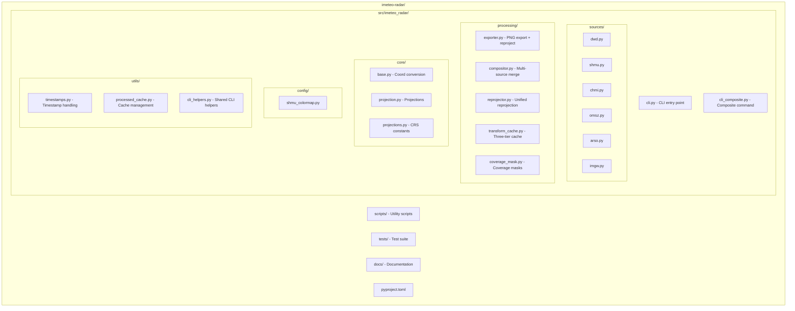

# Development Guide

Set up your development environment and contribute to iMeteo Radar.

---

## Prerequisites

- Python 3.9+
- Git
- Docker (optional, for testing)

---

## Local Setup

### 1. Clone Repository

```bash
git clone https://github.com/imeteo/imeteo-radar.git
cd imeteo-radar
```

### 2. Create Virtual Environment

```bash
python -m venv .venv
source .venv/bin/activate  # Linux/Mac
# .venv\Scripts\activate   # Windows
```

### 3. Install Package

```bash
# Development install (editable)
pip install -e ".[dev]"
```

This installs:
- Core dependencies (numpy, h5py, rasterio, matplotlib, requests, PIL, opencv-python, pyproj, netCDF4)
- Development tools (pytest, black, isort, mypy, flake8)

### 4. Verify Installation

```bash
imeteo-radar --help
```

---

## Project Structure



---

## Running Tests

### All Tests

```bash
pytest
```

### With Coverage

```bash
pytest --cov=src --cov-report=html
# View report: open htmlcov/index.html
```

### Specific Test

```bash
pytest tests/test_dwd.py
pytest tests/test_dwd.py::test_download_latest -v
```

### Test with Output

```bash
pytest -v -s  # Show print statements
```

---

## Code Quality

### Formatting (Black)

```bash
# Check formatting
black --check src/

# Apply formatting
black src/
```

Configuration: 88 character line length (default)

### Import Sorting (isort)

```bash
# Check imports
isort --check-only src/

# Sort imports
isort src/
```

### Type Checking (mypy)

```bash
mypy src/
```

### Linting (flake8)

```bash
flake8 src/
```

### Run All Checks

```bash
black src/ && isort src/ && mypy src/ && flake8 src/
```

---

## Local Testing with Docker

### Build Image

```bash
docker build -t imeteo-radar:dev .
```

### Test Commands

```bash
# Test fetch
docker run --rm -v /tmp/test:/tmp imeteo-radar:dev \
  imeteo-radar fetch --source dwd --disable-upload

# Test composite
docker run --rm -v /tmp/test:/tmp imeteo-radar:dev \
  imeteo-radar composite

# Check output
ls -la /tmp/test/germany/
```

### Clean Rebuild

```bash
docker build --no-cache -t imeteo-radar:dev .
```

---

## Adding a New Source

### 1. Create Source Class

Create `src/imeteo_radar/sources/newsource.py`:

```python
from .base import RadarSource

class NewSourceRadarSource(RadarSource):
    BASE_URL = "https://example.com/radar"

    def download_latest(self, count=1, products=None):
        """Download latest radar files."""
        pass

    def process_to_array(self, file_path):
        """Convert HDF5 to numpy array."""
        pass

    def get_extent(self):
        """Return geographic extent."""
        pass
```

### 2. Add to CLI

Update `src/imeteo_radar/cli.py`:

```python
# Add to source choices
parser.add_argument('--source', choices=['dwd', 'shmu', 'chmi', 'newsource'])

# Add to fetch_command
if args.source == 'newsource':
    from .sources.newsource import NewSourceRadarSource
    source = NewSourceRadarSource()
```

### 3. Add Tests

Create `tests/test_newsource.py`:

```python
def test_download_latest():
    source = NewSourceRadarSource()
    files = source.download_latest(count=1)
    assert len(files) >= 1

def test_process_to_array():
    source = NewSourceRadarSource()
    # ... test processing
```

### 4. Update Documentation

Add source to:
- `docs/cli-reference.md`
- `docs/architecture.md`
- `README.md`

---

## Memory Profiling

### Simple Profiler

```bash
python3 scripts/profile_memory.py --source dwd --disable-upload
```

### Multi-file (Leak Detection)

```bash
python3 scripts/profile_memory.py --source dwd --backload --hours 1 --disable-upload
```

Expected output:

```
Peak memory:    669 MB
After cleanup:  46 MB
Released:       93.2% ✅
```

---

## Debugging

### Enable Verbose Output

```bash
imeteo-radar fetch --source dwd 2>&1 | tee debug.log
```

### Python Debugger

```python
import pdb; pdb.set_trace()
```

### Check HDF5 Structure

```python
import h5py
with h5py.File('file.hdf', 'r') as f:
    def print_structure(name, obj):
        print(name)
    f.visititems(print_structure)
```

---

## Release Process

### 1. Update Version

Edit `pyproject.toml`:

```toml
version = "1.3.0"
```

### 2. Update Changelog

Add entry to `CHANGELOG.md`.

### 3. Run Tests

```bash
pytest
```

### 4. Create Tag

```bash
git tag v1.3.0
git push origin v1.3.0
```

### 5. Build Docker Image

```bash
./scripts/docker-push.sh
```

---

## Useful Scripts

### Generate Colorbar

```bash
python scripts/generate_colorbar.py --generate-all
```

### Analyze Data Availability

```bash
python scripts/analyze_radar_history.py --days 7
```

---

## Getting Help

- **Issues**: https://github.com/imeteo/imeteo-radar/issues
- **Docs**: See `/docs/` directory
