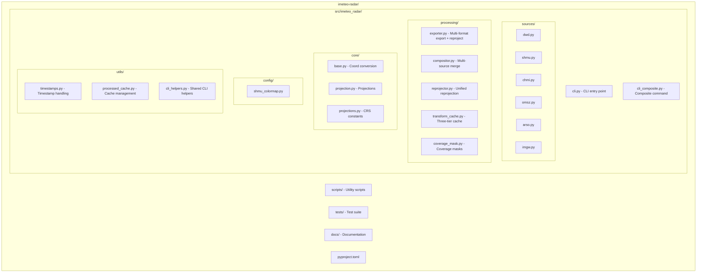

# Development Guide

Set up your development environment and contribute to iMeteo Radar.

---

## Prerequisites

- Python 3.11+ (uses `datetime.UTC` and modern type annotations)
- Git
- Docker (optional, for testing)

---

## Local Setup

### 1. Clone Repository

```bash
git clone https://github.com/imeteo/imeteo-radar.git
cd imeteo-radar
```

### 2. Create Virtual Environment

```bash
python -m venv .venv
source .venv/bin/activate  # Linux/Mac
# .venv\Scripts\activate   # Windows
```

### 3. Install Package

```bash
# Development install (editable)
pip install -e ".[dev]"
```

This installs:
- Core dependencies (numpy, h5py, rasterio, requests, PIL, pyproj, netCDF4, python-dotenv)
- Development tools (pytest, ruff, mypy)

### 4. Verify Installation

```bash
imeteo-radar --help
```

---

## Project Structure


```mermaid
graph TB
    subgraph root["imeteo-radar/"]
        subgraph src["src/imeteo_radar/"]
            CLI["cli.py - CLI entry point"]
            CLIC["cli_composite.py - Composite command"]

            subgraph sources["sources/"]
                DWD["dwd.py"]
                SHMU["shmu.py"]
                CHMI["chmi.py"]
                OMSZ["omsz.py"]
                ARSO["arso.py"]
                IMGW["imgw.py"]
            end

            subgraph processing["processing/"]
                EXP["exporter.py - Multi-format export + reproject"]
                COMP["compositor.py - Multi-source merge"]
                REPR["reprojector.py - Unified reprojection"]
                TCACHE["transform_cache.py - Three-tier cache"]
                CMASK["coverage_mask.py - Coverage masks"]
            end

            subgraph core["core/"]
                BASE["base.py - Coord conversion"]
                PROJ["projection.py - Projections"]
                PROJS["projections.py - CRS constants"]
            end

            subgraph config["config/"]
                CMAP["shmu_colormap.py"]
            end

            subgraph utils["utils/"]
                TS["timestamps.py - Timestamp handling"]
                CACHE["processed_cache.py - Cache management"]
                CLIH["cli_helpers.py - Shared CLI helpers"]
            end
        end

        SCRIPTS["scripts/ - Utility scripts"]
        TESTS["tests/ - Test suite"]
        DOCS["docs/ - Documentation"]
        PYPROJ["pyproject.toml"]
    end
```

---

## Running Tests

### All Tests

```bash
pytest
```

### With Coverage

```bash
pytest --cov=src --cov-report=html
# View report: open htmlcov/index.html
```

### Specific Test

```bash
pytest tests/test_dwd.py
pytest tests/test_dwd.py::test_download_latest -v
```

### Test with Output

```bash
pytest -v -s  # Show print statements
```

---

## Code Quality

### Linting & Formatting (ruff)

```bash
# Check for lint issues
ruff check src/

# Auto-fix lint issues
ruff check --fix src/

# Format code
ruff format src/

# Check formatting without applying
ruff format --check src/
```

### Type Checking (mypy)

```bash
mypy src/
```

### Run All Checks

```bash
ruff check src/ && ruff format --check src/ && mypy src/
```

---

## Local Testing with Docker

### Build Image

```bash
docker build -t imeteo-radar:dev .
```

### Test Commands

```bash
# Test fetch
docker run --rm -v /tmp/test:/tmp imeteo-radar:dev \
  imeteo-radar fetch --source dwd --disable-upload

# Test composite
docker run --rm -v /tmp/test:/tmp imeteo-radar:dev \
  imeteo-radar composite

# Check output
ls -la /tmp/test/germany/
```

### Clean Rebuild

```bash
docker build --no-cache -t imeteo-radar:dev .
```

---

## Adding a New Source

### 1. Create Source Class

Create `src/imeteo_radar/sources/newsource.py`:

```python
from .base import RadarSource

class NewSourceRadarSource(RadarSource):
    BASE_URL = "https://example.com/radar"

    def download_latest(self, count=1, products=None):
        """Download latest radar files."""
        pass

    def process_to_array(self, file_path):
        """Convert HDF5 to numpy array."""
        pass

    def get_extent(self):
        """Return geographic extent."""
        pass
```

### 2. Register in Source Registry

Update `src/imeteo_radar/config/sources.py`:

```python
# Add to SOURCE_REGISTRY
"newsource": SourceConfig(
    name="newsource",
    country="newcountry",
    folder="newcountry",
    source_class="NewSourceRadarSource",
    source_module="imeteo_radar.sources.newsource",
    product="maxz",
),
```

The CLI automatically picks up sources from the registry — no manual if/elif chains needed.

### 3. Add Tests

Create `tests/test_newsource.py`:

```python
def test_download_latest():
    source = NewSourceRadarSource()
    files = source.download_latest(count=1)
    assert len(files) >= 1

def test_process_to_array():
    source = NewSourceRadarSource()
    # ... test processing
```

### 4. Update Documentation

Add source to:
- `docs/cli-reference.md`
- `docs/architecture.md`
- `README.md`

---

## Memory Profiling

### Simple Profiler

```bash
python3 scripts/profile_memory.py --source dwd --disable-upload
```

### Multi-file (Leak Detection)

```bash
python3 scripts/profile_memory.py --source dwd --backload --hours 1 --disable-upload
```

Expected output:

```
Peak memory:    669 MB
After cleanup:  46 MB
Released:       93.2% ✅
```

---

## Debugging

### Enable Verbose Output

```bash
imeteo-radar fetch --source dwd 2>&1 | tee debug.log
```

### Python Debugger

```python
import pdb; pdb.set_trace()
```

### Check HDF5 Structure

```python
import h5py
with h5py.File('file.hdf', 'r') as f:
    def print_structure(name, obj):
        print(name)
    f.visititems(print_structure)
```

---

## Git Hooks

Three hooks enforce the git-flow workflow locally. Install them after cloning:

```bash
./scripts/install-hooks.sh
```

| Hook | Purpose |
|------|---------|
| `pre-commit` | Blocks commits on `main` — use a feature branch |
| `pre-push` | Blocks pushes to `refs/heads/main` — use a PR. Tag pushes are allowed. |
| `commit-msg` | Enforces conventional commit format: `<type>(<scope>): <description>` |

Allowed commit types: `feat`, `fix`, `refactor`, `docs`, `test`, `chore`, `perf`, `ci`, `release`

Hooks live in `scripts/hooks/` and are copied to `.git/hooks/` by the installer.

---

## Release Process

Use the interactive release script:

```bash
./scripts/release.sh
```

The script walks you through the full flow:

1. Checks you're on `main` with a clean working tree
2. Reads the current version from `pyproject.toml`
3. Prompts for bump type (major / minor / patch) and computes the new version
4. Creates a `release/vX.Y.Z` branch
5. Pauses for you to edit `pyproject.toml` (version) and `CHANGELOG.md`
6. Commits, pushes the branch, and prints the `gh pr create` command
7. After PR merge: prints the `git tag` and `git push` commands

### Manual steps (without the script)

```bash
# 1. Create release branch
git checkout -b release/v2.9.0

# 2. Bump version in pyproject.toml, add CHANGELOG.md entry, commit
git commit -m "release: v2.9.0"

# 3. Push and create PR
git push -u origin release/v2.9.0
gh pr create --title "release: v2.9.0"

# 4. After merge, tag and push
git checkout main && git pull
git tag v2.9.0 && git push origin v2.9.0
```

CI builds and pushes the Docker image automatically on tag push (`v*`).

---

## Useful Scripts

### Generate Colorbar

```bash
python scripts/generate_colorbar.py --generate-all
```

### Analyze Data Availability

```bash
python scripts/analyze_radar_history.py --days 7
```

---

## Getting Help

- **Issues**: https://github.com/imeteo/imeteo-radar/issues
- **Docs**: See `/docs/` directory
